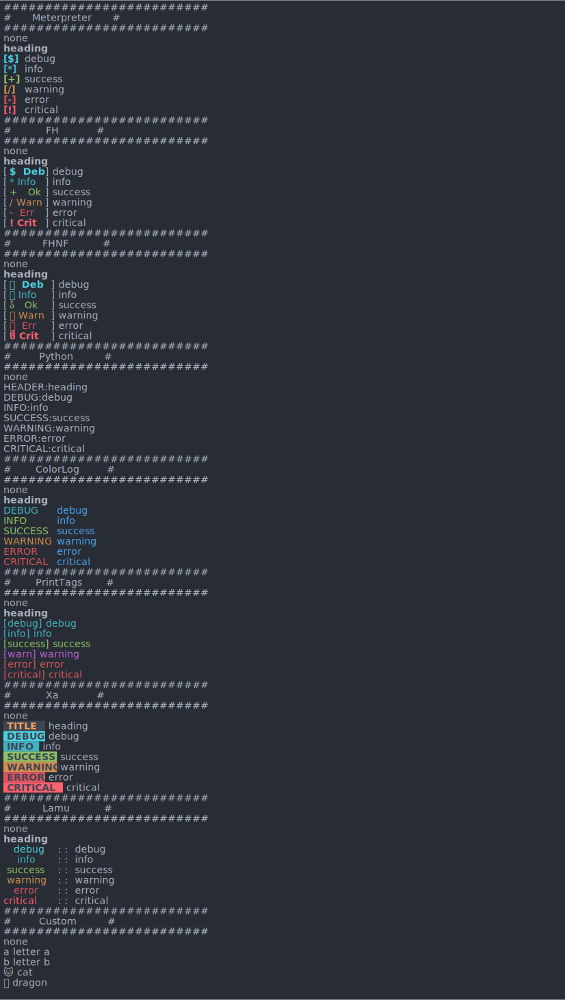

========================= No Longer Supported =========================

**This project has reached the end of development and is no longer
supported**

## What this means now

- The repository, issues, pull requests, labels, milestones, projects, wiki,
releases, commits, tags, branches, reactions and comments are read-only.
- The repository can still be forked and cloned - The License still applies.

## What this means in the future

- The repository is scheduled for deletion (the earliest date for this is
2022/10/01)
- The repository may be un-archived (however, this is very unlikely)

## Alternatives

### https://github.com/Delgan/loguru

Functions `['add', 'bind', 'catch', 'complete', 'configure', 'contextualize', 'critical', 'debug', 'disable', 'enable', 'error', 'exception', 'info', 'level', 'log', 'opt', 'parse', 'patch', 'remove', 'start', 'stop', 'success', 'trace', 'warning']`

Levels: bold ❌, italic ❌, header ❌, debug ✅, info ✅, success ✅, warning ✅, error ✅, critical ✅

```py
from loguru import logger
logger.debug("That's it, beautiful and simple logging!")

# FHFormatter
logger.add(sys.stdout, format="[<level>{level:^.4}</level>] {message}")

# Python
logger.add(sys.stdout, format="{level}:{message}")

# Colorlog
logger.add(sys.stdout, format="<level>{level:<9}</level> <blue>{message}</blue>")

# Print tags
logger.add(sys.stdout, format="<level>[{level}] {message}</level>")

# Xa
# https://loguru.readthedocs.io/en/stable/resources/recipes.html#adapting-colors-and-format-of-logged-messages-dynamically

# Lamu
logger.add(sys.stdout, format="<level>{level:>9}</level> :  : {message}")
```

### https://github.com/metachris/logzero

Functions `['addFilter', 'addHandler', 'callHandlers', 'critical', 'debug', 'disabled', 'error', 'exception', 'fatal', 'filter', 'filters', 'findCaller', 'getChild', 'getEffectiveLevel', 'handle', 'handlers', 'hasHandlers', 'info', 'isEnabledFor', 'level', 'log', 'makeRecord', 'manager', 'name', 'parent', 'propagate', 'removeFilter', 'removeHandler', 'root', 'setLevel', 'warn', 'warning']`

Levels: bold ❌, italic ❌, header ❌, debug ✅, info ✅, success ❌, warning ✅, error ✅, critical ✅

```py
import logzero
from logzero import logger
logger.debug("hello")


# FHFormatter
logzero.setup_default_logger(formatter=logzero.LogFormatter(fmt='%(color)s[%(levelname)4.4s]%(end_color)s %(message)s'))

# Python
logzero.setup_default_logger(formatter=logzero.LogFormatter(fmt='%(levelname)s:%(message)s'))

# Colorlog
logzero.setup_default_logger(formatter=logzero.LogFormatter(fmt='%(color)s[%(levelname)-9.9s]%(end_color)s %(message)s'))

# Print tags
logzero.setup_default_logger(formatter=logzero.LogFormatter(fmt='%(color)s[%(levelname)s] %(message)s%(end_color)s'))

# Xa
# ???

# Lamu
logzero.setup_default_logger(formatter=logzero.LogFormatter(fmt='%(color)s%(levelname)9.9s%(end_color)s :  : %(message)s'))
```

========================= No Longer Supported =========================

[](../../)
[](../../)
[](../../issues)
[](/LICENSE.md)
[](../../commits/master)
[](../../commits/master)
[](https://pypistats.org/packages/fhprint)
[](https://pepy.tech/project/fhprint)
[](https://pypi.org/project/fhprint)

<!-- omit in TOC -->
# FHPrint


Pretty print text in a range of builtin formats or make your own

Example usage in your project

```py
from fhprint import (LogCode, metPrint)

metPrint("none")
metPrint("heading", ll=LogCode.HEADING)
metPrint("debug", ll="d") # Can use LogCode or the string representation (d=debug)

metPrint("info", ll=LogCode.INFO)
metPrint("success", ll=LogCode.OK)
metPrint("warning", ll=LogCode.WARNING)
metPrint("error", ll=LogCode.ERROR)
metPrint("critical", ll=LogCode.CRITICAL)
```

Output of test.py
<div>

</div>

- [What this means now](#what-this-means-now)
- [What this means in the future](#what-this-means-in-the-future)
- [Alternatives](#alternatives)
	- [https://github.com/Delgan/loguru](#httpsgithubcomdelganloguru)
	- [https://github.com/metachris/logzero](#httpsgithubcommetachrislogzero)
- [Documentation](#documentation)
- [Install With PIP](#install-with-pip)
- [Language information](#language-information)
	- [Built for](#built-for)
- [Install Python on Windows](#install-python-on-windows)
	- [Chocolatey](#chocolatey)
	- [Windows - Python.org](#windows---pythonorg)
- [Install Python on Linux](#install-python-on-linux)
	- [Apt](#apt)
	- [Dnf](#dnf)
- [Install Python on MacOS](#install-python-on-macos)
	- [Homebrew](#homebrew)
	- [MacOS - Python.org](#macos---pythonorg)
- [How to run](#how-to-run)
	- [Windows](#windows)
	- [Linux/ MacOS](#linux-macos)
- [Download Project](#download-project)
	- [Clone](#clone)
		- [Using The Command Line](#using-the-command-line)
		- [Using GitHub Desktop](#using-github-desktop)
	- [Download Zip File](#download-zip-file)
- [Community Files](#community-files)
	- [Licence](#licence)
	- [Changelog](#changelog)
	- [Code of Conduct](#code-of-conduct)
	- [Contributing](#contributing)
	- [Security](#security)
	- [Support](#support)
	- [Rationale](#rationale)

## Documentation

A high-level overview of how the documentation is organized organized will help you know
where to look for certain things:

<!--
- [Tutorials](/documentation/tutorials) take you by the hand through a series of steps to get
  started using the software. Start here if you’re new.
-->
- The [Technical Reference](/documentation/reference) documents APIs and other aspects of the
  machinery. This documentation describes how to use the classes and functions at a lower level
  and assume that you have a good high-level understanding of the software.
<!--
- The [Help](/documentation/help) guide provides a starting point and outlines common issues that you
  may have.
-->

## Install With PIP

```python
pip install fhprint
```

Head to https://pypi.org/project/fhprint/ for more info

## Language information

### Built for

This program has been written for Python versions 3.7 - 3.10 and has been tested with both 3.7 and
3.10

## Install Python on Windows

### Chocolatey

```powershell
choco install python
```

### Windows - Python.org

To install Python, go to https://www.python.org/downloads/windows/ and download the latest
version.

## Install Python on Linux

### Apt

```bash
sudo apt install python3.x
```

### Dnf

```bash
sudo dnf install python3.x
```

## Install Python on MacOS

### Homebrew

```bash
brew install python@3.x
```

### MacOS - Python.org

To install Python, go to https://www.python.org/downloads/macos/ and download the latest
version.

## How to run

### Windows

- Module
	`py -3.x -m [module]` or `[module]` (if module installs a script)

- File
	`py -3.x [file]` or `./[file]`

### Linux/ MacOS

- Module
	`python3.x -m [module]` or `[module]` (if module installs a script)

- File
	`python3.x [file]` or `./[file]`

## Download Project

### Clone

#### Using The Command Line

1. Press the Clone or download button in the top right
2. Copy the URL (link)
3. Open the command line and change directory to where you wish to
clone to
4. Type 'git clone' followed by URL in step 2
	```bash
	git clone https://github.com/FHPythonUtils/fhprint
	```

More information can be found at
https://help.github.com/en/articles/cloning-a-repository

#### Using GitHub Desktop

1. Press the Clone or download button in the top right
2. Click open in desktop
3. Choose the path for where you want and click Clone

More information can be found at
https://help.github.com/en/desktop/contributing-to-projects/cloning-a-repository-from-github-to-github-desktop

### Download Zip File

1. Download this GitHub repository
2. Extract the zip archive
3. Copy/ move to the desired location

## Community Files

### Licence

MIT License
Copyright (c) FredHappyface
(See the [LICENSE](/LICENSE.md) for more information.)

### Changelog

See the [Changelog](/CHANGELOG.md) for more information.

### Code of Conduct

Online communities include people from many backgrounds. The *Project*
contributors are committed to providing a friendly, safe and welcoming
environment for all. Please see the
[Code of Conduct](https://github.com/FHPythonUtils/.github/blob/master/CODE_OF_CONDUCT.md)
 for more information.

### Contributing

Contributions are welcome, please see the
[Contributing Guidelines](https://github.com/FHPythonUtils/.github/blob/master/CONTRIBUTING.md)
for more information.

### Security

Thank you for improving the security of the project, please see the
[Security Policy](https://github.com/FHPythonUtils/.github/blob/master/SECURITY.md)
for more information.

### Support

Thank you for using this project, I hope it is of use to you. Please be aware that
those involved with the project often do so for fun along with other commitments
(such as work, family, etc). Please see the
[Support Policy](https://github.com/FHPythonUtils/.github/blob/master/SUPPORT.md)
for more information.

### Rationale

The rationale acts as a guide to various processes regarding projects such as
the versioning scheme and the programming styles used. Please see the
[Rationale](https://github.com/FHPythonUtils/.github/blob/master/RATIONALE.md)
for more information.
